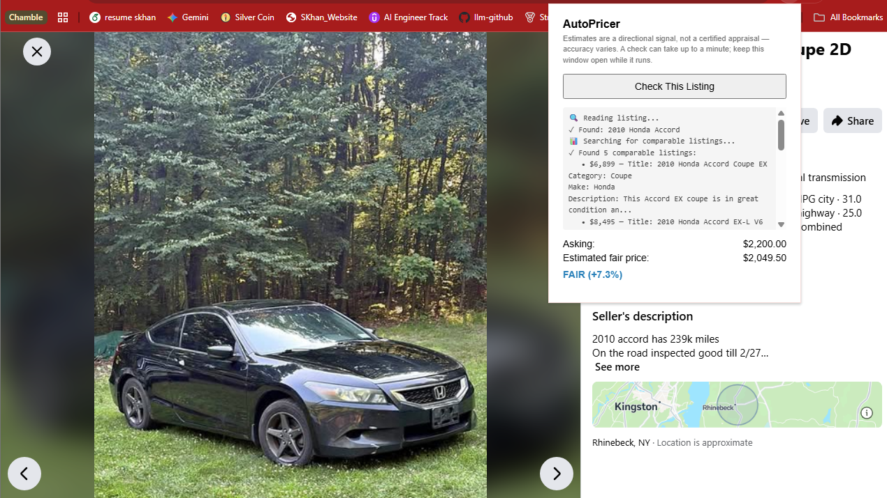
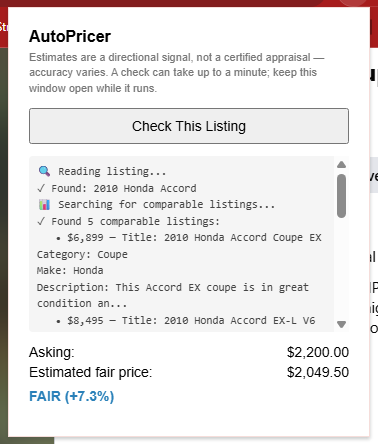

# AutoPricer

**A used-car price predictor and "is this listing fair?" Chrome extension**,
built end-to-end as a systematic tour through the modern AI engineering
stack: data curation → traditional ML → frontier LLM prompting → RAG →
QLoRA fine-tuning → multi-agent ensembling → serverless GPU deployment →
a real browser extension.

> Point it at a live Craigslist or Facebook Marketplace listing and it
> reads the page, extracts structured details, prices the car three
> different ways, and tells you whether the asking price is fair.



---

## Why this project exists

Most "I fine-tuned an LLM" portfolio projects stop at a notebook. This one
doesn't: the fine-tuned model is one of *three* pricing strategies running
behind a real deployed API, called from a real browser extension, working
on real listings I didn't write myself. The goal was to demonstrate the
full AI engineering loop, not just the fine-tuning step in the middle of it:

- **Data engineering** — clean and structure 500K raw listings into a
  usable, leakage-free ML dataset
- **Classical ML baselines** — know what "good" looks like before reaching
  for an LLM
- **Frontier LLM engineering** — structured extraction, prompt design,
  cost/latency tracking, chain-of-thought reasoning
- **Fine-tuning** — QLoRA a 3B open-weight model on the same task, on a
  single free-tier Colab GPU
- **RAG** — a 300K-vector semantic search layer for comparable-listing
  retrieval
- **Agentic system design** — multiple independent pricing "agents" run
  concurrently and combined into an ensemble, based on measured behavior,
  not intuition
- **Production deployment** — serverless GPU inference (Modal), a
  streaming API, and a Chrome extension consuming it live

---

## Live demo

Reading a real 2010 Honda Accord listing on Facebook Marketplace, the
extension streams back:

```
🔍 Reading listing...
✓ Found: 2010 Honda Accord

📊 Searching for comparable listings...
✓ Found 5 comparable listings:
  • $6,899 — 2010 Honda Accord Coupe EX
  • $8,495 — 2010 Honda Accord EX-L V6 Coupe
  • $8,995 — 2010 Honda Accord Coupe EX
  • $8,900 — 2010 Honda Accord EX Coupe
  • $7,995 — 2010 Honda Accord EX Coupe

Pricing agents running...
✓ Fine-tuned model estimate:  $2,999
✓ RAG-augmented estimate:     $1,100

Asking:              $2,200.00
Estimated fair price: $2,049.50
FAIR (+7.3%)
```

Two things worth calling out in that transcript, because they're honest
signal about how this kind of system actually behaves in the wild:

1. **The two pricing agents disagree by ~3x on this car** ($2,999 vs
   $1,100), even though the blended estimate ($2,049.50) lands close to
   the asking price. This specific listing — a 239K-mile car selling
   *below* most of its "comparable" 2010 Accords, which cluster around
   $7,000–9,000 despite much lower mileage — is a genuine edge case: high
   mileage and a below-market ask push both agents toward the tails of
   their training distribution, and they resolve the ambiguity
   differently. This is exactly the kind of case that motivated
   **ensembling two structurally different agents in the first place**:
   see [Why an ensemble](#why-an-ensemble-of-two-agents) below.
2. **The retrieved comps are a coupe, not the sedan/coupe-agnostic Accord
   in the listing** — a reminder that embedding-based retrieval finds
   *semantically* similar text, not a guaranteed apples-to-apples match.
   The comps are shown to the user transparently for exactly this reason:
   so a human can sanity-check them, not just trust a black-box number.

<table>
<tr><td></td>
<td></td></tr>
</table>

---

## Architecture

```
Chrome Extension (popup.html + popup.js)
    reads the active tab's DOM directly (no scraping libs — the user's
    already-logged-in browser sees whatever the site renders)
        │
        │  raw page text, POST /estimate
        ▼
FastAPI endpoint on Modal (auto_pricer_service.py)
  ├─ extraction.py         Gemini 2.5 Flash → structured ExtractedListing
  │                        (title, make, model, year, mileage, price, ...)
  │
  ├─ EnsembleAgent.price() runs two agents concurrently (ThreadPoolExecutor)
  │   │
  │   ├─ SpecialistAgent   → fine-tuned Llama-3.2-3B (QLoRA) on Modal GPU
  │   │                       no RAG context — see rationale below
  │   │
  │   └─ FrontierAgent     → Gemini 2.5 Flash + RAG
  │                           ChromaDB (300K listings) → 5 nearest comps
  │                           by embedding similarity → chain-of-thought
  │                           prompt → "FINAL PRICE: $X"
  │
  └─ verdict = asking vs. blended estimate (±10% = "fair")
        │
        │  NDJSON stream: extracted → comps_retrieved →
        │                 specialist_done → frontier_done → final
        ▼
Chrome popup renders live-ish progress + final verdict
```

---

## The 5-day build, notebook by notebook

Each notebook is a self-contained stage; running them in order reproduces
the whole pipeline from raw CSV to a deployed model.

### `1_curation.ipynb` — Data curation
- **500,000 raw used-car listings** (66 columns) loaded from a public
  used-cars CSV.
- Dropped 100%-null columns, truck-only fields, and listing metadata with
  no predictive value (VIN, lat/long, dealer IDs) → 49 columns.
- Dropped new-car listings (`is_new == True`) — a used-car pricer
  shouldn't learn MSRP/dealer-markup logic.
- Imputation strategy chosen per missingness pattern rather than one
  blanket rule: a damage/history cluster (5 correlated fields sharing
  ~40% missingness from one underlying report source) imputed to
  `False`; moderate-missingness numerics (horsepower, fuel economy,
  displacement) imputed to median; rows missing *required* fields
  (`price`, `mileage`, `year`, `make`, `model`) dropped outright.
- Threshold filters: price $500–$150,000, model year ≥ 1990, mileage
  ≤ 300,000 — removes junk/placeholder rows without being so aggressive
  it discards legitimate high-mileage beaters or classic cars.
- Pushed to the **Hugging Face Hub** as a versioned dataset
  (`ShahidHKhan/cars_full_processed`) rather than kept as local files —
  reproducible, shareable, and pulls cleanly into a Colab GPU session
  later without re-uploading anything.

### `2_preprocessing.ipynb` — LLM-assisted preprocessing
- Used **litellm + Gemini 2.5 Flash-Lite** to turn structured rows into
  natural-language listing summaries — the actual training text for
  every downstream model (baselines, fine-tune, and RAG corpus all key
  off this same field).
- Batched with concurrent workers + `tqdm`, with cost tracked per call
  (Gemini is priced per input/output token — this stage's total cost
  was estimated and monitored before running at full 500K scale, not
  after).
- Final split: **231,947 train / 12,886 val / 12,886 test** — a clean,
  fixed test set that every model below (baseline, frontier, fine-tuned,
  ensemble) is scored against, so results are actually comparable to
  each other.

### `3_baselines.ipynb` — Classical ML baselines
Before reaching for an LLM, establish what "good" looks like with
cheap, fast, fully-interpretable models:

| Model | Features | Test MAE | Test R² |
|---|---|---|---|
| Linear Regression | mileage, age, text length | $8,007.24 | 29.9% |
| Random Forest | Bag-of-words (`CountVectorizer`) on summary text | **$3,327.15** | 82.9%(train 87.5%) |
| XGBoost | Bag-of-words on summary text | $3,570.36 | 82.8% (train 95.1%) |

Random Forest on plain bag-of-words text features turned out to be a
genuinely strong, cheap baseline — good context for judging whether the
much more expensive frontier/fine-tuning work below was actually worth it.

### `4_frontier.ipynb` — Frontier LLM zero-shot pricing
- Prompted **Gemini 2.5 Flash** and **Gemini 2.5 Pro** zero-shot (no
  fine-tuning, no RAG) to price the same held-out test cars, parsing the
  numeric answer out of free-form completions.
- **Gemini 2.5 Flash**, full 1,452-car test-sample run: **MAE $2,996.45**
  (median $2,082.50), total cost **$3.52** for the batch — meaningfully
  better than the classical baselines above, at a real but small dollar
  cost, with zero training required.
- **Gemini 2.5 Pro**, 50-car sample: MAE $3,326.40 — notably *not* better
  than Flash on this task, despite being the larger/more expensive model.
  That's a useful, resume-worthy finding on its own: bigger frontier
  model ≠ better result for every task, and it's worth measuring before
  assuming otherwise.
- Every run tracks **cost and parse-failure rate** alongside accuracy —
  treating an LLM call like a production dependency with a cost budget
  and a failure mode, not just a black box that returns a number.

### Day 1–3 (`day1_qlora_intro.ipynb`, `day2_base_model_eval.ipynb`, `day3_training.ipynb`) — QLoRA fine-tuning
Run on **Google Colab** (free-tier T4 GPU), fine-tuning
**`meta-llama/Llama-3.2-3B`**:

- **Quantization math worked through explicitly** before training, not
  taken on faith: 4-bit NF4 quantization brings the base model's memory
  footprint down to **2.2 GB** (vs. 3.6 GB at 8-bit), which is what makes
  fine-tuning a 3B model feasible on a free T4 at all.
- **LoRA config sizing compared directly**: an attention-only, `r=32`
  "lite" config trains **18.35M** parameters (73.4 MB adapter) vs. a
  full attention+MLP `r=256` config at **389M** parameters (1.56 GB
  adapter, 21x larger) — the lite config was the deliberate choice for
  the free-tier hardware budget.
- **T4-specific gotchas hit and fixed during real debugging** (documented
  in-notebook so they're not lost): T4 GPUs lack bf16 tensor cores, so
  `bnb_4bit_compute_dtype` must be `float16`, not the more commonly
  copy-pasted `bfloat16` — using bf16 caused a ~100x training slowdown.
  `bf16=False` also has to be set *explicitly* in `SFTConfig`, since it
  silently auto-detects `True` otherwise even with `fp16=True` already
  set. LoRA (trainable) parameters were kept in fp32 for AMP's
  `GradScaler` to work correctly, while the frozen base model stayed fp16.
- **Training run**: 1 epoch, batch size 32, `r=32` LoRA (`lora_alpha=64`),
  attention-layers-only (`q/k/v/o_proj`), cosine LR schedule,
  `paged_adamw_32bit` optimizer, 816 total steps — small and fast enough
  to iterate on a free GPU, deliberately traded off against the larger
  config above.
- Final adapter pushed to the Hugging Face Hub
  (`ShahidHKhan/autopricer-full`) and loaded via PEFT/bitsandbytes for
  inference.

### `7_rag.ipynb` — Retrieval-augmented generation
- Built a **ChromaDB vectorstore of 300,000 listings** (merged from two
  batches), embedded with `sentence-transformers/all-MiniLM-L6-v2`.
- `FrontierAgent` retrieves the 5 nearest comparable listings by
  embedding similarity and injects them into the Gemini pricing prompt
  as context, alongside a **chain-of-thought instruction** ("reason
  about how this car compares to the comps, then answer on a
  `FINAL PRICE: $X` line") — parsed with a regex tuned specifically to
  avoid grabbing a *comp's* price mentioned earlier in the reasoning
  instead of the model's actual final number.
- **A genuinely useful negative result surfaced here**: injecting the
  *same* RAG comps into the *fine-tuned* model's prompt made it worse,
  not better — MAE $1,691.80 without RAG vs. $2,490.93 with RAG on a
  15-car sample. The fine-tuned model was never trained on a prompt
  shape that includes comps, so it anchors on them crudely instead of
  reasoning about them. **`SpecialistAgent` deliberately does not use
  RAG as a result** — a real example of validating an assumption
  ("more context = better") with data instead of shipping it because it
  sounded reasonable.

### Why an ensemble of two agents
A controlled 15-car benchmark, run in `7_rag.ipynb`, compared all three
final strategies on identical cars:

| Agent | MAE (15-car sample) |
|---|---|
| Specialist (fine-tuned Llama-3.2-3B, no RAG) | $1,691.80 |
| Frontier (Gemini 2.5 Flash + RAG comps) | $1,599.20 |
| **Ensemble (50/50 blend)** | **$1,202.10** |

The 50/50 blend beats *both* individual agents, not just the average of
their two error rates — evidence the two agents tend to miss on
different cars in different directions, so averaging cancels out
independent error rather than just splitting the difference. This is
the actual justification baked into `EnsembleAgent`'s default 0.5
weighting, not an arbitrary choice.

### `8_scraper.ipynb` / `5_promptbuilding.ipynb` / `6_modaldeployment.ipynb`
- `5_promptbuilding.ipynb` — building and iterating on the Gemini
  structured-extraction schema (`ExtractedListing`) that turns raw page
  text into the same fields the training data was built from.
- `8_scraper.ipynb` — early listing-scraping/extraction experiments,
  precursor to the extension's live DOM-reading approach.
- `6_modaldeployment.ipynb` — deploying `AutoPricer` (the fine-tuned
  model) and `PricingEndpoint` (the FastAPI app) as a single Modal app,
  including the one-time vectorstore-unzip-into-a-Volume step
  (`vectorstore_setup.py`).

---

## The Chrome extension

```
chrome_extension/
  popup.html + popup.js   → reads document.body.innerText from the
                             active tab (no scraping library — reads the
                             user's own already-logged-in DOM), POSTs it
                             to the Modal endpoint, streams back NDJSON
                             progress + final verdict
  manifest.json
```

- **No login/scraping infra required** — because the extension reads the
  DOM the user is already looking at, it works on both Craigslist and
  Facebook Marketplace (auth-gated) without ever handling credentials.
- **Streaming backend, verified with real timing gaps** — a standalone
  test script (`test_stream.py`) confirmed the FastAPI `StreamingResponse`
  genuinely emits `extracting → extracted → comps_retrieved → agent
  results` at different wall-clock timestamps (not buffered
  server-side), 26–100s total depending on Modal cold start.
- **Concurrent agent calls** — `SpecialistAgent` and `FrontierAgent` run
  in a `ThreadPoolExecutor`, not sequentially, since they're independent
  network calls (Modal GPU + Gemini API) with no data dependency between
  them.

---

## Deployment

- **Modal** (serverless GPU) hosts two classes in one app:
  - `AutoPricer` (T4 GPU) — loads the fine-tuned model via
    PEFT/bitsandbytes 4-bit quantization, exposes `.price()` as a
    remote method
  - `PricingEndpoint` (CPU) — loads `EnsembleAgent` once per container
    (`@modal.enter()`), serves a FastAPI `/estimate` endpoint
- **`MIN_CONTAINERS=0`** on both apps by default — costs nothing while
  idle, at the expense of a cold-start delay on the first request after
  ~2 minutes idle. A deliberate cost/latency tradeoff, not an oversight.
- Verified end-to-end via `curl`/PowerShell **and** through the live
  extension on real Craigslist and Facebook Marketplace listings.

---

## Tech stack

| Layer | Tools |
|---|---|
| Data / cleaning | pandas, numpy, pydantic |
| Classical ML | scikit-learn, XGBoost |
| Frontier LLM calls | litellm, Gemini 2.5 Flash / Flash-Lite / Pro |
| Fine-tuning | transformers, peft, trl, bitsandbytes, QLoRA on Llama-3.2-3B |
| RAG | ChromaDB, sentence-transformers (`all-MiniLM-L6-v2`) |
| Dataset hosting | Hugging Face Hub (`datasets`) |
| Serving | FastAPI, Modal (serverless GPU + CPU containers) |
| Client | Chrome Extension (Manifest V3), vanilla JS |
| Compute | Local (VS Code/Jupyter) for Days 1–4, Colab (free T4) for fine-tuning |

---

## Known limitations (documented, not hidden)

Being upfront about what's rough is part of engineering honestly — these
are tracked, not swept under the rug:

- **Live-progress UI doesn't visibly stream in the popup**, even though
  the backend genuinely streams (verified server-side) — root cause
  (browser `fetch()` buffering vs. a DOM repaint issue) wasn't fully
  isolated. The extension still returns a complete, correct result either
  way; this only affects the progress animation.
- **No auth on the public endpoint** (`CORSMiddleware` wide open) — a
  deliberate tradeoff for a demo/portfolio project, not something to be
  exposed at real scale without adding a shared-secret/API-key check
  first.
- **Chain-of-thought prompt rewrite for `FrontierAgent` was deployed but
  not re-benchmarked** against the original bare-number prompt — the MAE
  numbers cited above are from before that change. Treat the
  chain-of-thought version as a reasonable, un-verified hypothesis, not
  a proven accuracy win.
- **Gemini pricing is not fully deterministic** even at `temperature=0`
  (~±$1-2k swing observed on identical inputs) — `seed` was tried and
  dropped after litellm rejected it for Gemini models outright.

---

## Repo structure

```
notebooks/
  1_curation.ipynb            data cleaning, HF Hub push
  2_preprocessing.ipynb       Gemini-generated listing summaries, splits
  3_baselines.ipynb           Linear Regression / Random Forest / XGBoost
  4_frontier.ipynb            zero-shot Gemini Flash / Pro pricing
  5_promptbuilding.ipynb      structured-extraction prompt design
  6_modaldeployment.ipynb     Modal app deployment
  7_rag.ipynb                 ChromaDB vectorstore + ensemble benchmarking
  8_scraper.ipynb             listing extraction experiments
  day1_qlora_intro.ipynb      quantization + LoRA sizing math
  day2_base_model_eval.ipynb  pre-fine-tune baseline eval
  day3_training.ipynb         QLoRA training run (Colab, T4)
  day5_test_finetuned.ipynb   fine-tuned model evaluation

auto_pricer/
  agents/
    base_agent.py
    specialist_agent.py       fine-tuned model, no RAG
    frontier_agent.py         Gemini + RAG, chain-of-thought
    ensemble_agent.py         weighted blend of the two above
    extraction.py             Gemini structured extraction
  car.py                      Car schema (pydantic)
  evaluator.py                shared MAE/plotting test harness

auto_pricer_service.py        Modal app: AutoPricer + PricingEndpoint
vectorstore_setup.py          one-time Modal Volume setup script

chrome_extension/
  manifest.json
  popup.html
  popup.js
```

---

## What this project demonstrates

- Structuring a real ML problem end-to-end, not just training a model in
  isolation — from raw, messy data through to a client someone can
  actually click a button on.
- Choosing classical-ML baselines deliberately, before reaching for an
  LLM, and using them to judge whether the more expensive approaches
  were actually worth it.
- Working fine-tuning knowledge: quantization tradeoffs, LoRA config
  sizing, and hardware-specific debugging (T4 bf16/fp16 issues) reasoned
  through explicitly rather than copy-pasted.
- RAG as an engineering component with a measured effect — including the
  discipline to *not* apply it somewhere it measurably hurt
  (`SpecialistAgent`).
- Agentic system design justified by a controlled benchmark (the
  ensemble weighting), not intuition.
- Full-stack delivery: a deployed streaming API on serverless GPU infra,
  consumed by a real, working browser extension on real websites.
- Honest tracking of cost, latency, and known rough edges — the kind of
  operational awareness that matters as much as the modeling itself.
